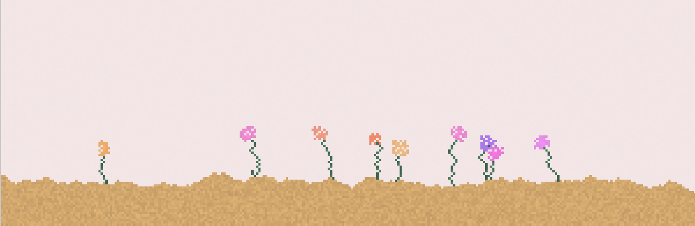
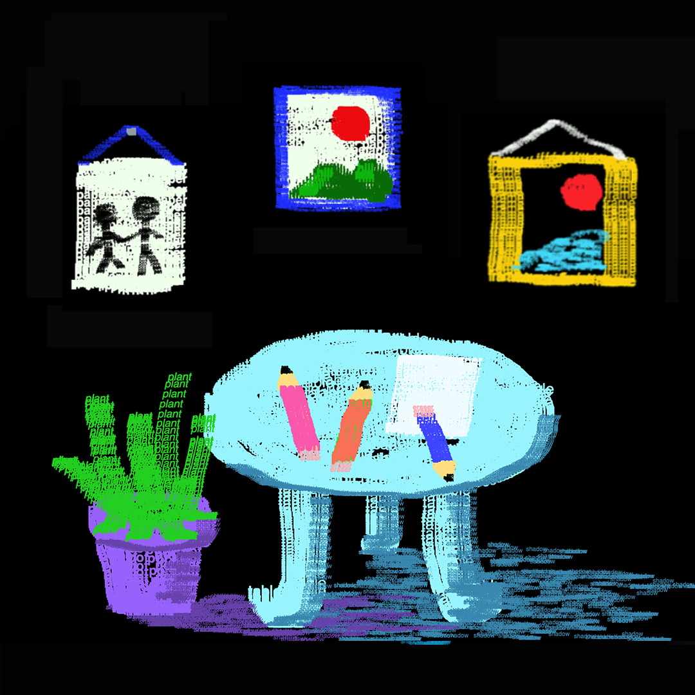
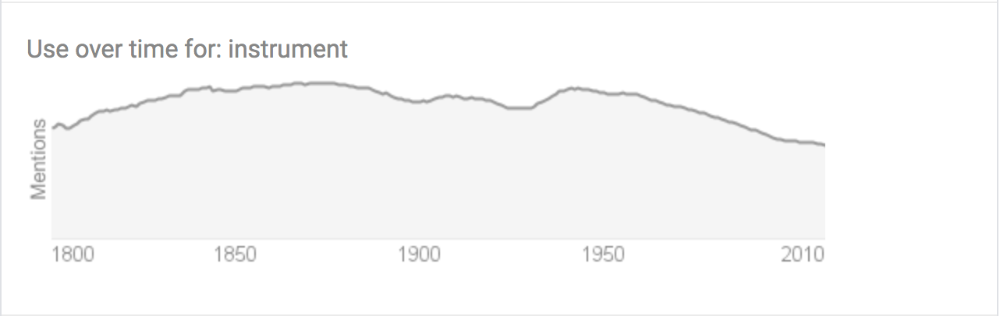
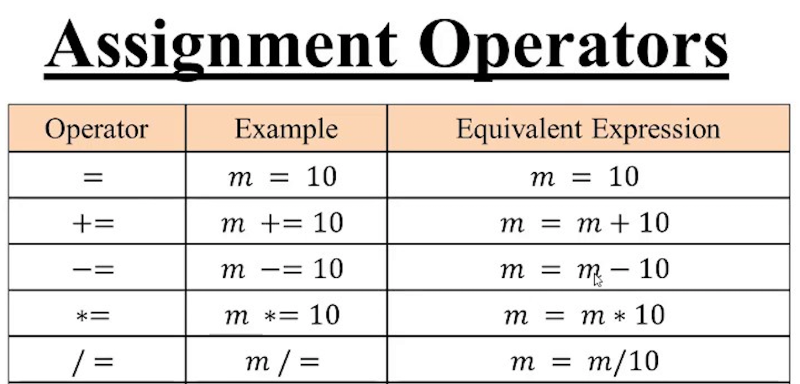

# Creative Drawing Instrument Building With P5js

<!-- using text instead of dots !!!!! -->


[Fernando Ramallo](https://fernandoramallo.github.io/2019/)


[sandSpiel](https://sandspiel.club/)



[Flickgame](https://www.flickgame.org/)

[Sok-stroies by Sokpop](https://sok-stories.com/?WUFF)

[Pen, Memory](https://pen-memory.herokuapp.com/) 



[some more games]


## [Creative Instruments](https://www.merriam-webster.com/dictionary/instrument)


#### What Is A Creative Instrument? 


#### who do you make this instrument for? 


#### How do you want them to use it? 

#### sharing/open source 


## GAMES!!!! 

### 1. exquisite corpse 

[draw what you thing Alexa looks like - Melanie Hoff](https://docs.google.com/document/d/e/2PACX-1vS02YTBRsxnA5bmdtI5HdAwJ5raAzvcEe5cvWjIx_njRx9DvNt9rxJmZZ9BfvNT0eVvIdoguM6eLmxP/pub)


### 2. drawing with limitations 
<!-- second accitivity is to ask them to use one pen and one of their belongs to make a drawing(with limitations) -->


## [P5.js](https://p5js.org/download/)

[https://p5js.org/](https://p5js.org/)

[Online Editor](https://editor.p5js.org/)


## Code
<!-- talk about scope?????? -->
### 1. [functions](https://p5js.org/reference/#/p5/function)
a set of statements that performs a task or calculates a value. To use a function you must <i><b>define</b></i> it somewhere in the <i><b>scope</b></i> from which you wish to <i><b>call</b></i> it. 

#### scope
the current context of execution. 
Global and local

#### defining a function 
```javascript 
function welcome(){
	console.log("welcome to my drawing instrument!")
}
```
#### calling a function
```javascript 
welcome()
```

### 2. [setup](https://p5js.org/reference/#/p5/setup)

setup function is called once when the program starts.

```javascript
function setup(){
	createCanvas(500,500)
	background(255);
}
```

### 3. [draw](https://p5js.org/reference/#/p5/draw)
draw function continuously executes the lines of code contained inside its block until the program is stopped. 
```javascript
function draw(){
	circle(250,250,40)
}
```

### 4. declare variable
```javascript 
let d = random(400)
```

### 5. [if Statemenets](https://p5js.org/reference/#/p5/if-else)

if statement executes the code if a specified condition is ture. 
```javascript 
		  
  if (d < 200){
    stroke(0,0,200)
  } else {
    stroke(200,0,0)
  }
```


### 6. [mouseIsPressed](https://p5js.org/reference/#/p5/mouseIsPressed)

mouseIsPressed is a <i><b>boolean</b></i> value, is TRUE when mouse is pressed, and false when mouse is released

```javascript
	if (mouseIsPressed){
		circle(mouseX, mouseY, 3)
	} 
```


### 7. [Slider](https://p5js.org/reference/#/p5/createSlider)
syntax for slider: createSlider(min, max, [value], [step])

```javascript 
// in setup()
	colorMode(HSB)
	sliderColor = createSlider(0,255)
	text('color:', 0,10)
	sliderR.position(0,30)
	sliderR.style('width', '100px')


// in draw()

	let colorPicked = sliderR.value()

	<!-- hug, saturation, brightness, opacity -->
	fill(colorPicked, 100, 100, 1)

```


### 8. [random](https://p5js.org/reference/#/p5/random) and [operations](src/operators.png)
```javascript 

// in setup() 
	sliderD = createSlider(3,10)
  	text('size', 0, 60)
  	sliderD.position(10,60)

// in draw()
	let size = sliderD.value()
	size += random(10)
	if (mouseIsPressed){
		circle(mouseX, mouseY, size)
	} 
```



## code Refrences

#### [circle](https://p5js.org/reference/#/p5/circle)
#### [shapes](https://p5js.org/reference/#group-Shape)
#### [frameRate](https://p5js.org/reference/#/p5/frameRate)
#### [text](https://p5js.org/reference/#/p5/text)
#### [colorMode](https://p5js.org/reference/#/p5/colorMode)
#### [fill](https://p5js.org/reference/#/p5/fill), [noFill](https://p5js.org/reference/#/p5/noFill)
#### [stroke](https://p5js.org/reference/#/p5/stroke), [noStroke](https://p5js.org/reference/#/p5/noStroke)
#### [mouseX](https://p5js.org/reference/#/p5/mouseX), [mouseY](https://p5js.org/reference/#/p5/mouseY)
#### [position](https://p5js.org/reference/#/p5.Element/position)
#### [value](https://p5js.org/reference/#/p5.Element/value)
#### [style](https://p5js.org/reference/#/p5.Element/styles)
#### [foundations](https://p5js.org/reference/#group-Foundation)